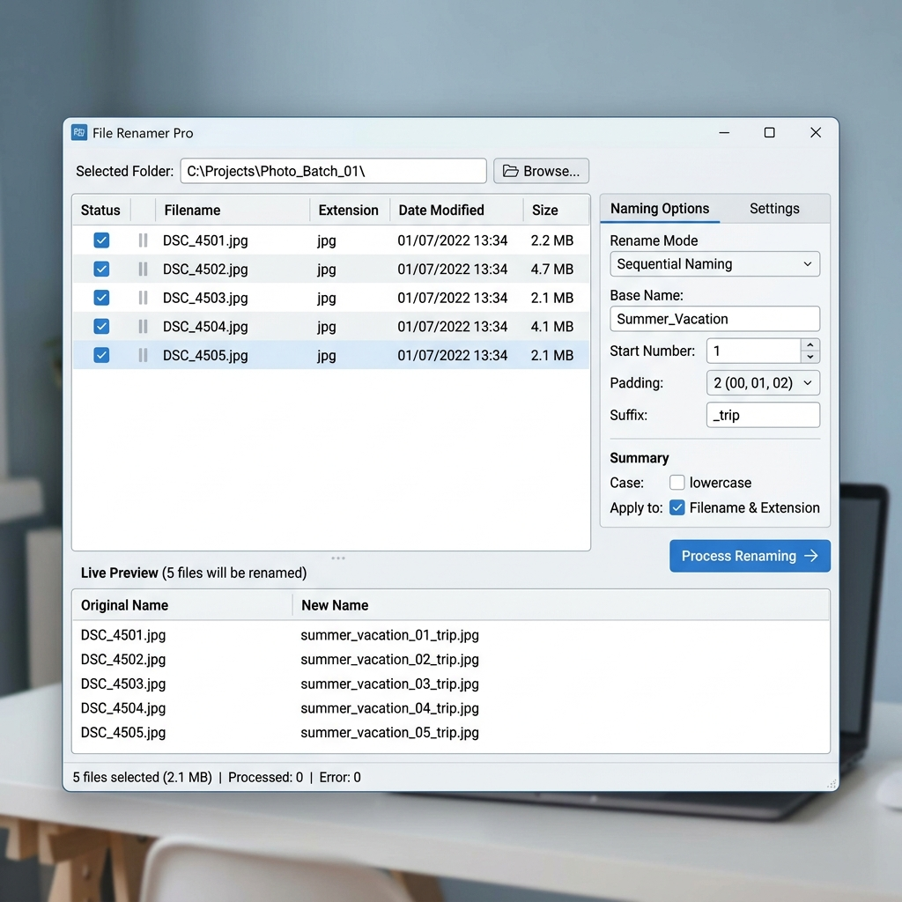

# Bulk Renamer

A powerful, drag-and-drop batch file renamer with live preview and duplicate detection.  
Built with Python's Tkinter – runs on Windows, macOS, and Linux.



## Features

- ✅ **Natural sorting** – numbers inside filenames are compared numerically (e.g., `file2` before `file10`)
- ✅ **Drag & drop reordering** – change the sequence of files before renaming
- ✅ **Preview Panel** – integrated panel showing image thumbnails, folder contents, and file metadata
- ✅ **Live rename preview** – see new names instantly while typing; duplicate names are highlighted
- ✅ **Flexible naming**:
  - Base name (optional)
  - Sequential number with custom start value
  - Padding (choose from `1`, `01`, `001`, `0001`)
  - Optional suffix after the number
- ✅ **Conflict handling**:
  - "Yes", "Yes to All", "No", "No to All", "Cancel"
- ✅ **Safe operation** – moves files (rename) using `shutil.move`; existing files are never overwritten without permission
- ✅ **Error reporting** – modal dialog lists all failed operations

## Installation

1. **Python 3.7+** is required.  
   Download from [python.org](https://python.org) if you don't have it.

2. Tkinter is included with standard Python distributions.  
   On **Linux** (e.g., Ubuntu/Debian), you may need to install it separately:
   ```bash
   sudo apt-get install python3-tk
   ```

3. **Install dependencies**:
   ```bash
   pip install -r requirements.txt
   ```

4. **Run the application**:
   ```bash
   python Main.py
   ```

## How to Use

1. **Select Folder**: Click the "Select Folder" button to load your files.
2. **Reorder Files**: Click and drag items in the list to change their numbering order.
3. **Configure Naming**:
   - **Base Name**: The prefix for all files (e.g., `Vacation_`).
   - **Start Number**: What number to begin with (e.g., `1`).
   - **Padding**: How many digits to use (e.g., `01`, `001`).
   - **Suffix**: Text to add after the number (e.g., `_HD`).
4. **Live Preview**: Check the "Preview" area to see how names will look. Duplicate names are highlighted in red with a ⚠ symbol.
5. **Rename**: Click "Rename Files" to apply changes. You will be prompted if file conflicts occur.


## Technical Details

- **Language**: Python 3.x
- **UI Framework**: Tkinter (Standard Library)
- **Natural Sorting**: Uses regex-based natural sorting to handle numeric strings correctly.
- **Error Handling**: Implements comprehensive error catching for file system operations (Permissions, IO errors).

## License

This project is licensed under the [MIT License](LICENSE).
